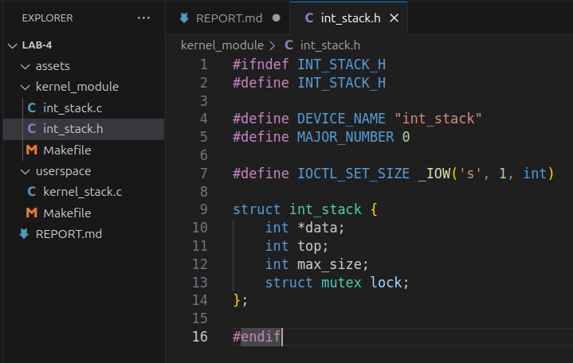
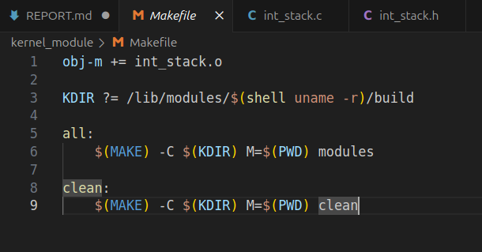
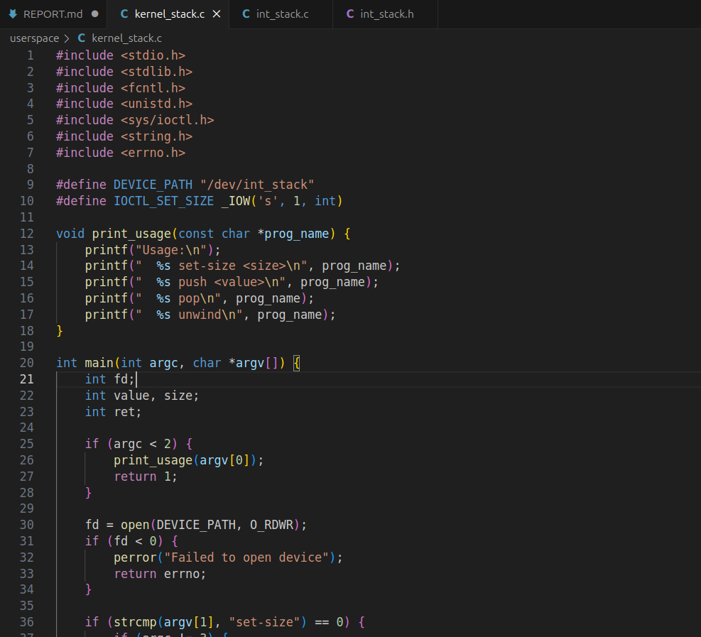
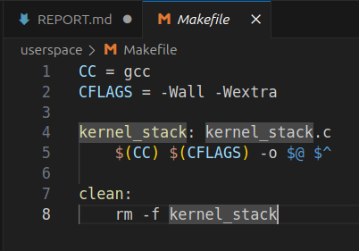
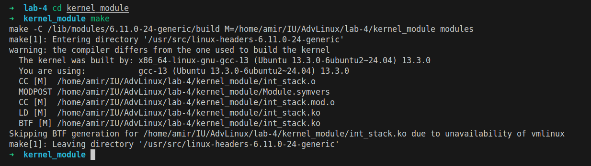
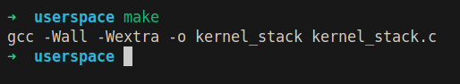
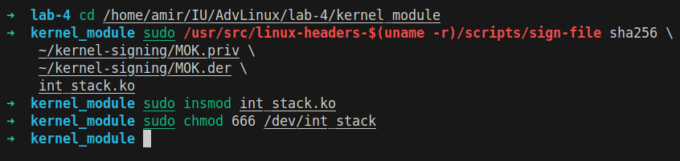
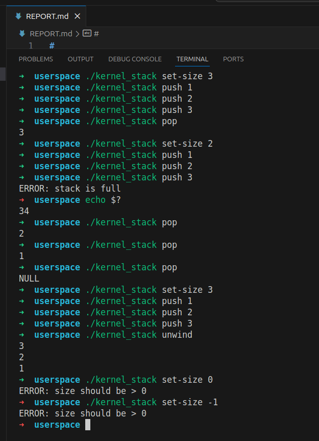

# Lab 4: Integer Stack Kernel Module Implementation
**Amir Gubaidullin CBS-01**  
**am.gubaidullin@innopolis.university**  
May 4, 2025

## 1. Introduction

Linux kernel module that provides an integer stack data structure accessed through character device. The module supports basic stack operations (push/pop) and stack size configuration via ioctl system calls. User-space utility provides command-line interface for interacting with the kernel module


## 2. Objectives

- Implement a kernel module with dynamic memory allocation
- Implement thread-safe operations using mutex synchronization
- Create a character device driver with file operations
- Develop a user-space CLI utility for device interaction
- Handle edge cases and error conditions properly

## 3. Implementation

### 3.1 I created project structure

```bash
mkdir -p kernel_module userspace
```

The project is organized into two main components:

```bash
lab-4/
├── kernel_module/
│   ├── int_stack.h
│   ├── int_stack.c
│   └── Makefile
└── userspace/
    ├── kernel_stack.c
    └── Makefile
```

### 3.2 Header file implementation

Hheader file (int_stack.h) defines the core data structures, constants:



Key components:

- Device name definition for registration
- IOCTL command for stack size configuration
- Stack structure with dynamic array, top pointer, maximum size
- Mutex for thread synchronization

### 3.3 Kernel module implementation

The kernel module (int_stack.c) implements the character device driver:


1. **Module Initialization (`int_stack_init`):**
   - Dynamic device number allocation
   - Device class creation for automatic device file generation
   - Character device registration
   - Stack structure allocation and initialization

2. **File Operations:**
   - `open()` and `release()`: Basic file operations (currently minimal implementation)
   - `read()`: Implements pop operation, returns 0 bytes when stack is empty
   - `write()`: Implements push operation, returns -ERANGE when stack is full
   - `ioctl()`: Configures stack size, validates input, manages memory allocation

3. **Thread Safety:**
   - All stack operations are protected by mutex locks
   - Proper lock/unlock sequences in error paths
   - Prevents race conditions during concurrent access

4. **Module Cleanup (`int_stack_exit`):**
   - Frees allocated memory
   - Unregisters character device
   - Destroys device class
   - Releases device number

Then created kernel module makefile:



Features:

- Out-of-tree module compilation
- Automatic kernel version detection
- Clean target for build artifacts


### 3.4 User-space utility

The user-space program (kernel_stack.c) provides a CLI interface:



Supported commands:

- `set-size <size>`: Configure stack size
- `push <value>`: Add element to stack
- `pop`: Remove and display top element
- `unwind`: Remove and display all elements

Then created user-space makefile:



Features:

- Strict compilation flags (-Wall -Wextra)
- Simple build process for CLI utility

### 3.5 Building and testing

Successfully built both components:
- Kernel module compiled without warnings
- User-space utility compiled with strict flags

**Builded kernel module:**



**Built user-space utility:**



**I faced some issues due to Secure Boot being enabled, the module required signing before loading:**

```bash
# Create signing keys
cd ~
mkdir kernel-signing
cd kernel-signing
openssl req -new -x509 -newkey rsa:2048 -keyout MOK.priv -outform DER -out MOK.der -nodes -days 36500 -subj "/CN=Local Kernel Module Signing/"
openssl x509 -in MOK.der -inform DER -outform PEM -out MOK.pem
sudo mokutil --import MOK.der

# Reboot and enroll MOK

# Sign the module
cd /home/amir/IU/AdvLinux/lab-4/kernel_module
sudo /usr/src/linux-headers-$(uname -r)/scripts/sign-file sha256 \
    ~/kernel-signing/MOK.priv \
    ~/kernel-signing/MOK.der \
    int_stack.ko
```

### 3.6 Module loading

After signing, the module was successfully loaded:



### 3.7 Test cases

I ran test cases:



Executed test cases demonstrating:

1. **Basic Operations:**
   - Setting stack size
   - Push operations
   - Pop operations
   - Stack full error handling
   - Stack empty handling

2. **Edge Cases:**
   - Invalid size values (≤0)
   - Stack overflow behavior
   - Empty stack pop
   - Unwind operation
   - Error code verification

### 3.8 Resubmission

**Check items are saved when the stack size increases**


**Check for deleting items when reducing the stack size**


**Check correctness of operations after resizing**


## Appendix

### `kernel_module/int_stack.h: Header file`

```h
#ifndef INT_STACK_H
#define INT_STACK_H

#define DEVICE_NAME "int_stack"
#define MAJOR_NUMBER 0

#define IOCTL_SET_SIZE _IOW('s', 1, int)

struct int_stack {
    int *data;
    int top;
    int max_size;
    struct mutex lock;
};

#endif
```


### `kernel_module/int_stack.c: Kernel module implementation`

```c
#include <linux/module.h>
#include <linux/kernel.h>
#include <linux/init.h>
#include <linux/fs.h>
#include <linux/device.h>
#include <linux/cdev.h>
#include <linux/slab.h>
#include <linux/uaccess.h>
#include <linux/mutex.h>

#include "int_stack.h"

MODULE_LICENSE("GPL");
MODULE_AUTHOR("Amir Gubaidullin");
MODULE_DESCRIPTION("Integer Stack Character Device");
MODULE_VERSION("0.1");

static dev_t dev_num;
static struct cdev c_dev;
static struct class *cl;
static struct int_stack *stack;

// Function prototypes
static int device_open(struct inode *, struct file *);
static int device_release(struct inode *, struct file *);
static ssize_t device_read(struct file *, char __user *, size_t, loff_t *);
static ssize_t device_write(struct file *, const char __user *, size_t, loff_t *);
static long device_ioctl(struct file *, unsigned int, unsigned long);

static struct file_operations fops = {
    .open = device_open,
    .release = device_release,
    .read = device_read,
    .write = device_write,
    .unlocked_ioctl = device_ioctl,
    .owner = THIS_MODULE,
};

static int device_open(struct inode *inode, struct file *file)
{
    return 0;
}

static int device_release(struct inode *inode, struct file *file)
{
    return 0;
}

static ssize_t device_read(struct file *filp, char __user *buffer, size_t length, loff_t *offset)
{
    int value;
    int ret;
    
    if (length < sizeof(int))
        return -EINVAL;

    mutex_lock(&stack->lock);
    
    // Pop operation
    if (stack->top == -1) {
        mutex_unlock(&stack->lock);
        return 0; // Return 0 bytes if stack is empty
    }
    
    value = stack->data[stack->top];
    stack->top--;
    
    mutex_unlock(&stack->lock);
    
    ret = copy_to_user(buffer, &value, sizeof(int));
    if (ret)
        return -EFAULT;
    
    return sizeof(int);
}

static ssize_t device_write(struct file *filp, const char __user *buffer, size_t length, loff_t *offset)
{
    int value;
    int ret;
    
    if (length < sizeof(int))
        return -EINVAL;

    ret = copy_from_user(&value, buffer, sizeof(int));
    if (ret)
        return -EFAULT;

    mutex_lock(&stack->lock);
    
    // Push operation
    if (stack->max_size > 0 && stack->top >= stack->max_size - 1) {
        mutex_unlock(&stack->lock);
        return -ERANGE; // Stack is full
    }
    
    stack->top++;
    stack->data[stack->top] = value;
    
    mutex_unlock(&stack->lock);
    
    return sizeof(int);
}

static long device_ioctl(struct file *file, unsigned int cmd, unsigned long arg)
{
    int size;
    int ret;
    
    switch (cmd) {
    case IOCTL_SET_SIZE:
        ret = copy_from_user(&size, (int __user *)arg, sizeof(int));
        if (ret)
            return -EFAULT;
        
        if (size <= 0)
            return -EINVAL;
        
        mutex_lock(&stack->lock);
        
        // Free old buffer if exists
        if (stack->data) {
            kfree(stack->data);
            stack->data = NULL;
        }
        
        // Allocate new buffer
        stack->data = kmalloc(size * sizeof(int), GFP_KERNEL);
        if (!stack->data) {
            mutex_unlock(&stack->lock);
            return -ENOMEM;
        }
        
        stack->max_size = size;
        stack->top = -1;  // Reset stack
        
        mutex_unlock(&stack->lock);
        
        return 0;
        
    default:
        return -EINVAL;
    }
}

static int __init int_stack_init(void)
{
    // Allocate device number
    if (alloc_chrdev_region(&dev_num, 0, 1, DEVICE_NAME) < 0) {
        pr_err("Failed to allocate device number\n");
        return -1;
    }

    // Create device class
    cl = class_create("chardrv");
    if (IS_ERR(cl)) {
        unregister_chrdev_region(dev_num, 1);
        pr_err("Failed to create class\n");
        return PTR_ERR(cl);
    }

    // Create device
    if (device_create(cl, NULL, dev_num, NULL, DEVICE_NAME) == NULL) {
        class_destroy(cl);
        unregister_chrdev_region(dev_num, 1);
        pr_err("Failed to create device\n");
        return -1;
    }

    // Initialize and add cdev
    cdev_init(&c_dev, &fops);
    if (cdev_add(&c_dev, dev_num, 1) == -1) {
        device_destroy(cl, dev_num);
        class_destroy(cl);
        unregister_chrdev_region(dev_num, 1);
        pr_err("Failed to add cdev\n");
        return -1;
    }

    // Allocate memory for stack structure
    stack = kmalloc(sizeof(struct int_stack), GFP_KERNEL);
    if (!stack) {
        cdev_del(&c_dev);
        device_destroy(cl, dev_num);
        class_destroy(cl);
        unregister_chrdev_region(dev_num, 1);
        pr_err("Failed to allocate stack structure\n");
        return -ENOMEM;
    }

    // Initialize stack
    stack->data = NULL;
    stack->top = -1;
    stack->max_size = 0;
    mutex_init(&stack->lock);

    pr_info("int_stack: module loaded\n");
    return 0;
}

static void __exit int_stack_exit(void)
{
    if (stack) {
        if (stack->data)
            kfree(stack->data);
        kfree(stack);
    }

    cdev_del(&c_dev);
    device_destroy(cl, dev_num);
    class_destroy(cl);
    unregister_chrdev_region(dev_num, 1);
    
    pr_info("int_stack: module unloaded\n");
}

module_init(int_stack_init);
module_exit(int_stack_exit);
```


### `kernel_module/Makefile: Kernel module build configuration`

```makefile
obj-m += int_stack.o

KDIR ?= /lib/modules/$(shell uname -r)/build

all:
	$(MAKE) -C $(KDIR) M=$(PWD) modules

clean:
	$(MAKE) -C $(KDIR) M=$(PWD) **clean**
```


### `userspace/kernel_stack.c: User-space utility`

```c
#include <stdio.h>
#include <stdlib.h>
#include <fcntl.h>
#include <unistd.h>
#include <sys/ioctl.h>
#include <string.h>
#include <errno.h>

#define DEVICE_PATH "/dev/int_stack"
#define IOCTL_SET_SIZE _IOW('s', 1, int)

void print_usage(const char *prog_name) {
    printf("Usage:\n");
    printf("  %s set-size <size>\n", prog_name);
    printf("  %s push <value>\n", prog_name);
    printf("  %s pop\n", prog_name);
    printf("  %s unwind\n", prog_name);
}

int main(int argc, char *argv[]) {
    int fd;
    int value, size;
    int ret;

    if (argc < 2) {
        print_usage(argv[0]);
        return 1;
    }

    fd = open(DEVICE_PATH, O_RDWR);
    if (fd < 0) {
        perror("Failed to open device");
        return errno;
    }

    if (strcmp(argv[1], "set-size") == 0) {
        if (argc != 3) {
            print_usage(argv[0]);
            close(fd);
            return 1;
        }
        
        size = atoi(argv[2]);
        if (size <= 0) {
            printf("ERROR: size should be > 0\n");
            close(fd);
            return 1;
        }
        
        ret = ioctl(fd, IOCTL_SET_SIZE, &size);
        if (ret < 0) {
            perror("ioctl failed");
            close(fd);
            return errno;
        }
    }
    else if (strcmp(argv[1], "push") == 0) {
        if (argc != 3) {
            print_usage(argv[0]);
            close(fd);
            return 1;
        }
        
        value = atoi(argv[2]);
        ret = write(fd, &value, sizeof(int));
        if (ret < 0) {
            if (errno == ERANGE) {
                printf("ERROR: stack is full\n");
                close(fd);
                return 34;  // Return ERANGE
            }
            perror("write failed");
            close(fd);
            return errno;
        }
    }
    else if (strcmp(argv[1], "pop") == 0) {
        ret = read(fd, &value, sizeof(int));
        if (ret == 0) {
            printf("NULL\n");
        } else if (ret < 0) {
            perror("read failed");
            close(fd);
            return errno;
        } else {
            printf("%d\n", value);
        }
    }
    else if (strcmp(argv[1], "unwind") == 0) {
        while ((ret = read(fd, &value, sizeof(int))) > 0) {
            printf("%d\n", value);
        }
        if (ret < 0) {
            perror("read failed");
            close(fd);
            return errno;
        }
    }
    else {
        print_usage(argv[0]);
        close(fd);
        return 1;
    }

    close(fd);
    return 0;
}
```


### `userspace/Makefile: User-space build configuration`

```makefile
CC = gcc
CFLAGS = -Wall -Wextra

kernel_stack: kernel_stack.c
	$(CC) $(CFLAGS) -o $@ $^

clean:
	rm -f kernel_stack
```

