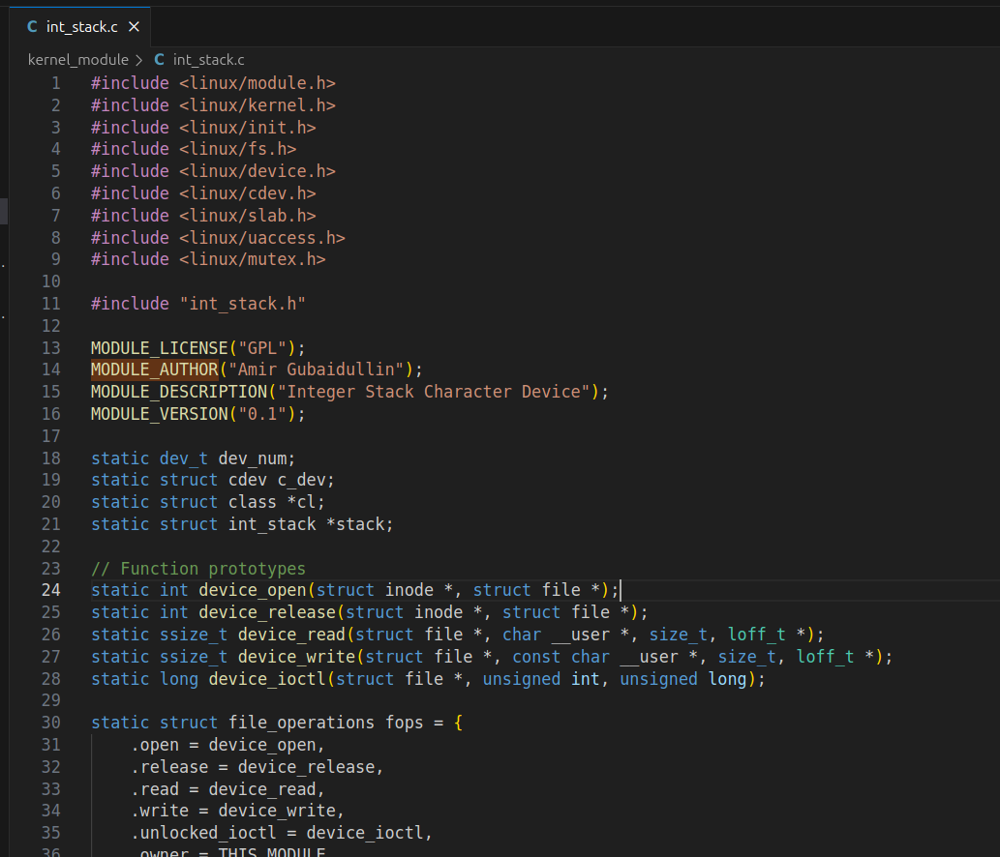
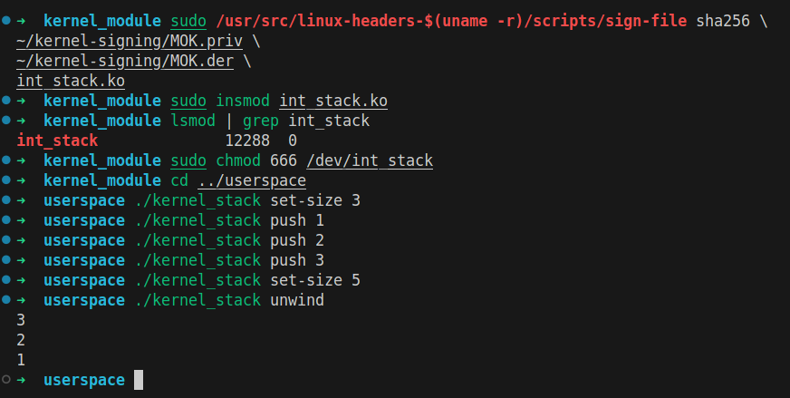
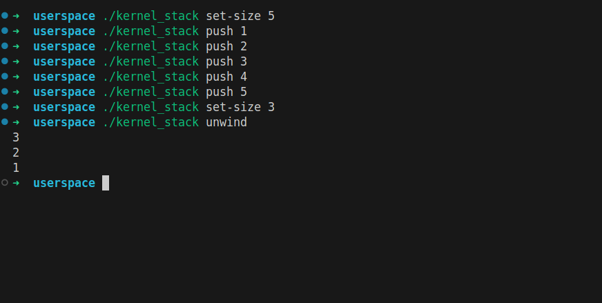
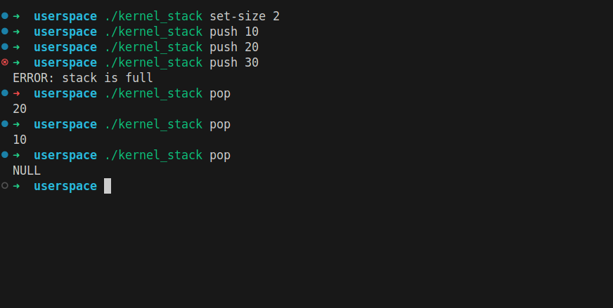

# Lab 4: Integer Stack Kernel Module Implementation
**Amir Gubaidullin CBS-01**  
**am.gubaidullin@innopolis.university**  
May 4, 2025

**Github repo:** https://github.com/dExNight/Advanced-Linux-Lab4

## 1. Introduction

Linux kernel module that provides an integer stack data structure accessed through character device. The module supports basic stack operations (push/pop) and stack size configuration via ioctl system calls. User-space utility provides command-line interface for interacting with the kernel module


## 2. Objectives

- Implement a kernel module with dynamic memory allocation
- Implement thread-safe operations using mutex synchronization
- Create a character device driver with file operations
- Develop a user-space CLI utility for device interaction
- Handle edge cases and error conditions properly

## 3. Implementation

### 3.1 I created project structure

```bash
mkdir -p kernel_module userspace
```

The project is organized into two main components:

```bash
lab-4/
├── kernel_module/
│   ├── int_stack.h
│   ├── int_stack.c
│   └── Makefile
└── userspace/
    ├── kernel_stack.c
    └── Makefile
```

### 3.2 Header file implementation

Hheader file (int_stack.h) defines the core data structures, constants:


Key components:

- Device name definition for registration
- IOCTL command for stack size configuration
- Stack structure with dynamic array, top pointer, maximum size
- Mutex for thread synchronization

### 3.3 Kernel module implementation

The kernel module (int_stack.c) implements the character device driver:



1. **Module Initialization (`int_stack_init`):**
   - Dynamic device number allocation
   - Device class creation for automatic device file generation
   - Character device registration
   - Stack structure allocation and initialization

2. **File Operations:**
   - `open()` and `release()`: Basic file operations (currently minimal implementation)
   - `read()`: Implements pop operation, returns 0 bytes when stack is empty
   - `write()`: Implements push operation, returns -ERANGE when stack is full
   - `ioctl()`: Configures stack size, validates input, manages memory allocation

3. **Thread Safety:**
   - All stack operations are protected by mutex locks
   - Proper lock/unlock sequences in error paths
   - Prevents race conditions during concurrent access

4. **Module Cleanup (`int_stack_exit`):**
   - Frees allocated memory
   - Unregisters character device
   - Destroys device class
   - Releases device number

Then created kernel module makefile:


Features:

- Out-of-tree module compilation
- Automatic kernel version detection
- Clean target for build artifacts


### 3.4 User-space utility

The user-space program (kernel_stack.c) provides a CLI interface:


Supported commands:

- `set-size <size>`: Configure stack size
- `push <value>`: Add element to stack
- `pop`: Remove and display top element
- `unwind`: Remove and display all elements

Then created user-space makefile:


Features:

- Strict compilation flags (-Wall -Wextra)
- Simple build process for CLI utility

### 3.5 Building and testing

Successfully built both components:
- Kernel module compiled without warnings
- User-space utility compiled with strict flags

**Builded kernel module:**


**Built user-space utility:**


**I faced some issues due to Secure Boot being enabled, the module required signing before loading:**

```bash
# Create signing keys
cd ~
mkdir kernel-signing
cd kernel-signing
openssl req -new -x509 -newkey rsa:2048 -keyout MOK.priv -outform DER -out MOK.der -nodes -days 36500 -subj "/CN=Local Kernel Module Signing/"
openssl x509 -in MOK.der -inform DER -outform PEM -out MOK.pem
sudo mokutil --import MOK.der

# Reboot and enroll MOK

# Sign the module
cd /home/amir/IU/AdvLinux/lab-4/kernel_module
sudo /usr/src/linux-headers-$(uname -r)/scripts/sign-file sha256 \
    ~/kernel-signing/MOK.priv \
    ~/kernel-signing/MOK.der \
    int_stack.ko
```

### 3.6 Module loading

After signing, the module was successfully loaded:


### 3.7 Test cases

I ran test cases:


Executed test cases demonstrating:

1. **Basic Operations:**
   - Setting stack size
   - Push operations
   - Pop operations
   - Stack full error handling
   - Stack empty handling

2. **Edge Cases:**
   - Invalid size values (≤0)
   - Stack overflow behavior
   - Empty stack pop
   - Unwind operation
   - Error code verification

### 3.8 Resubmission

**Check items are saved when the stack size increases**



**Check for deleting items when reducing the stack size**



**Check correctness of operations after resizing**


